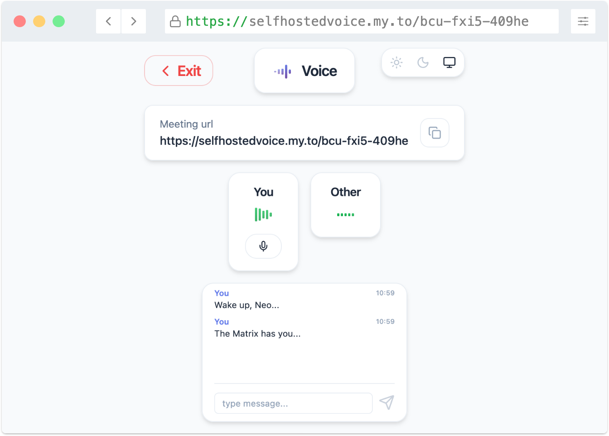

   

**A minimalistic, self-hostable WebRTC voice chat.**

## Built with
**Client:** React 19, TypeScript, Vite, Zustand, Socket.IO Client  
**Server:** Express, Socket.IO Server, Bun  
**Infra:** Docker, nginx, coturn, Let's Encrypt

## Prerequisites
- **Server**: Linux VPS with 1 GB RAM or more
- **Domain**: Any domain pointing to your server's IP (free options: [FreeDNS](https://freedns.afraid.org), [DuckDNS](https://www.duckdns.org))
- **Docker**
- **Open Ports**: 80 (HTTP), 443 (HTTPS), 3478 (TURN server), 49152-49172 (TURN server UDP range)  

<br>
   

## Installation

### 1. Clone Repository

```bash
git clone https://github.com/makesnosense/voice.git
cd voice
```

### 2. Configure Environment

```bash
cp .env.selfhost.example .env
nano .env  # or use vim, micro, etc.
```

Edit the following in `.env`:

```bash
DOMAIN=your-domain.com        # your actual domain
EMAIL=your-email@example.com  # for Let's Encrypt notifications
COTURN_SECRET=                # generate with: openssl rand -base64 32
```

To generate a strong secret:

```bash
openssl rand -base64 32
```

### 3. Choose Your Setup Path
#### Option A: Setup script
If you don't mind using a setup script, this is the fastest way. (setup.sh is just two `docker run` commands)
```bash
bash setup.sh
docker compose up -d
```

That's it! ✨

Your voice chat is now running at `https://your-domain.com`


#### Option B: Manual Step-by-Step
##### Step 1: Get SSL Certificate
Load environment variables and get certificate:

```bash
source .env

docker run --rm -p 80:80 \
  -v voice_certbot-conf:/etc/letsencrypt \
  certbot/certbot certonly --standalone \
  --email ${EMAIL} \
  --agree-tos --no-eff-email --non-interactive \
  -d ${DOMAIN}
```
You should see: `Successfully received certificate`

##### Step 2: Build Frontend

```bash
source .env
docker run --rm \
  -v ./client:/app/client \
  -v ./shared:/app/shared \
  -v voice_client-dist:/app/dist \
  -e VITE_TURN_SERVER_HOST=${DOMAIN} \
  -e VITE_TURN_SERVER_PORT=${VITE_TURN_SERVER_PORT} \
  -w /app/client \
  node:alpine \
  sh -c "npm ci && npm run build && cp -r dist/* /app/dist/"
```

This takes 1-2 minutes. You should see: `✓ built in XXs`
##### Step 3: Start Services

```bash
docker compose up -d
```
