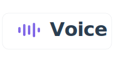
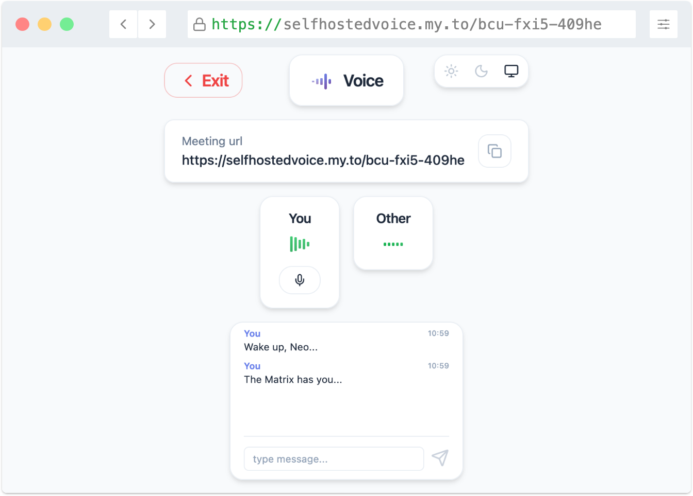

**A minimalistic, self-hostable WebRTC voice chat.**

## Built with

**Client:** React 19, TypeScript, Vite, Zustand, Socket.IO Client  
**Server:** Express, Socket.IO Server, Bun  
**Infra:** Docker, nginx, coturn, Let's Encrypt

<br>


## Download

[](https://github.com/makesnosense/voice/releases?q=android%20app)

## Self-hosting

For a simple, dependency-free self-hosted version, see the [v1.0-selfhost](https://github.com/makesnosense/voice/releases/tag/v1.0-selfhost) release.

## Development

Depending on the development scope, there are four tiers of requirements:

| Tier | Scope                        | Added requirement          |
| ---- | ---------------------------- | -------------------------- |
| 1    | Web UI, non-call features    |                            |
| 2    | Web calls                    | Local coturn               |
| 3    | Mobile UI, non-call features | Firebase project           |
| 4    | Mobile calls                 | Publicly accessible coturn |

Each tier is a superset of the previous.

### Base setup (all tiers)

**1. Install dependencies**

```bash
cd shared && npm install
cd server && bun install
cd client && npm install
```

**2. Set up SSL certs**

```bash
sudo mkcert -install
sudo ./scripts/issue-server-dev-certs.sh
```

**3. Set up dev database**

```bash
./scripts/spin-up-dev-postgres.sh
```

**4. Configure environment**

Copy `.env.development.example` to `.env.development` and fill in the values.

**5. Run server and web client**

```bash
cd server && bun run dev
cd client && npm run dev
```

### Tier 2: Local web calls

Local coturn instance is needed.

Set in `.env.development`:

```
COTURN_SECRET=any-string
VITE_TURN_SERVER_HOST=localhost
VITE_TURN_SERVER_PORT=3478
```

Spin up local coturn instance:

```bash
cd coturn
docker build -t voice-coturn-dev .
docker run -d \
 --name voice-coturn-dev \
 --env-file ../.env.development \
 --network host \
 --restart unless-stopped \
 voice-coturn-dev
```

### Tier 3: Mobile

**1. Set up your own Firebase project and download `google-services.json` to `mobile/android/app/`**

**2. Run `sudo ./scripts/issue-mobile-dev-cert.sh`**

**3. Create `mobile/android/local.properties` with `sdk.dir=/path/to/Android/Sdk`**

```bash
cd mobile && npm install
npm run android
```

### Tier 4: Mobile calls

Requires a publicly reachable TURN server. On a Linux VPS with a public IP:

**1. Clone the repo**

```bash
git clone https://github.com/makesnosense/voice.git
cd voice
```

**2. Create `.env` in the root**

```bash
COTURN_SECRET=your-secret
VITE_TURN_SERVER_HOST=your-vps-ip-or-domain
VITE_TURN_SERVER_PORT=3478
```

**3. Build and run coturn**

```bash
cd coturn
docker build -t voice-coturn .
docker run -d \
  --name voice-coturn \
  --env-file ../.env \
  --network host \
  --restart unless-stopped \
  voice-coturn
```

**4. In your local .env.development, set `COTURN_SECRET`, `VITE_TURN_SERVER_HOST`, and `VITE_TURN_SERVER_PORT` to the same values as in step 2.**
